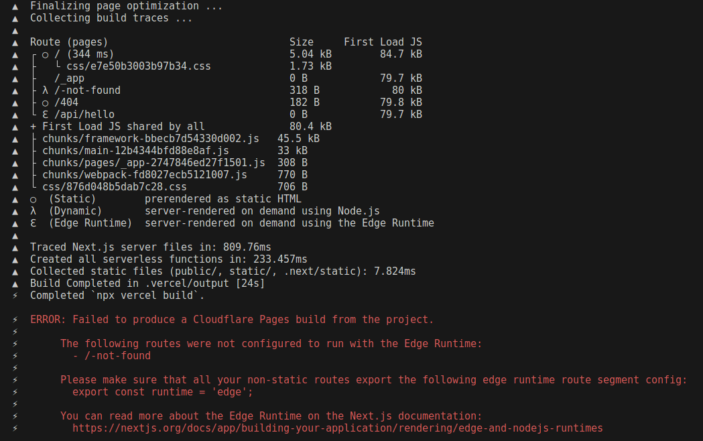
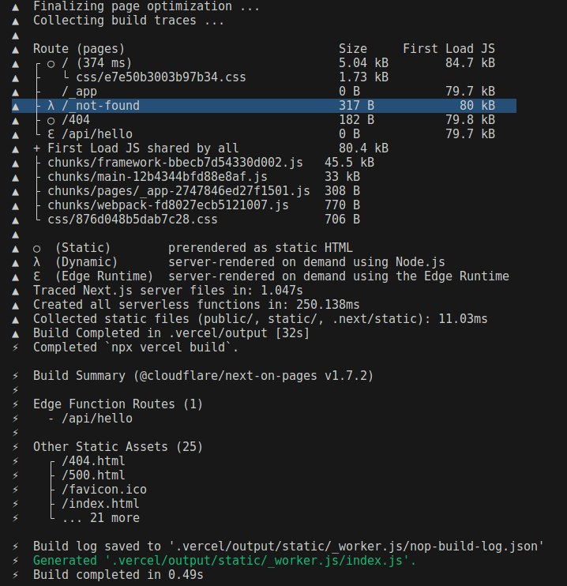

# next-on-pages _not-found Pages router bug reproduction

Notice that running
```sh
npm run pages:build
```
correctly fails complaining that the -not-found route is using the node runtime:



However if you rename the `pages/-not-found.tsx` file to `pages/_not-found.tsx` and try
again, then the build process incorrectly completes successfully (removing the `_not-found` route):



That is because we delete the incorrect `_not-found` route that the App Router can generate...